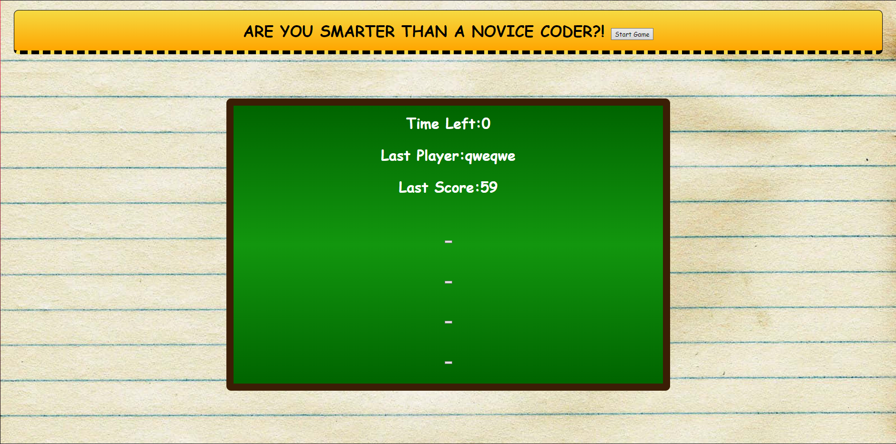

# Are You Smarter Than A Novice Coder?

## Table of Contents
* [Deployed Site](deployed-site)
* [Purpose](purpose)
* [Learning Points](learning-points)
* [Expectations vs Reality](expectations-vs-reality)
* [Resources Used](resources-used)
* [Contact Info](contact-info)

## Deployed Site

[Visit the Deployed Site](https://jacklcmore.github.io/RUSmarterThanANoviceCoder/)


## Purpose

Why would I go out of my way to fully code a quiz? The answer is to test my progress of course!

Over the past couple weeks I have learned A LOT about HTML, CSS, and most recently javaScript. The only way to test my newly acquired skills and knowledge was to put it into practice!

I am very proud of my final product and believe this is an integral point of my coding career! The hardships I went through making this quiz have been key in expanding my coding skillset.

## Learning Points

Where do I start with this topic? I learned so much creating this quiz, but here are the things I consider the most important:

```
function timerStart(){
    timer.textContent = 90;
    var count = setInterval(function(){
    if(timer.textContent > 0)
        timer.textContent--;
     else{
        clearInterval(count);
        endGame();
        };
    },1000);
}
```
While making a timer was not new to me, the reliance on it for the rest of the quiz was a big eye opener, and allowed me to understand the necessity for manipulating variables throughout a given code.

```
function question2(){
    questionBlock.textContent = Q2.question;
    answerA.textContent = Q2.answer1;
    answerB.textContent = Q2.answer2;
    answerC.textContent = Q2.answer3;
    answerD.textContent = Q2.answer4;
    buttonA.removeEventListener("click",wrongAnswer);
    buttonB.removeEventListener("click",question2);
    buttonC.removeEventListener("click",wrongAnswer);
    buttonD.removeEventListener("click",wrongAnswer);
    buttonA.addEventListener("click",wrongAnswer);
    buttonB.addEventListener("click",wrongAnswer);
    buttonC.addEventListener("click",wrongAnswer);
    buttonD.addEventListener("click",question3);
}
```
This one was difficult for me. I tried for hours to stop my event listeners from persisting over to the next question, early on I had researched and found out about the removeEventListener method but had thought I could go about solving this issue another way. After hours of testing other ways to code out the persisting click listeners I settled on this method because it was the only thing that worked for me. I definitely learned that the easy/reliable resolution for a problem is sometimes necessary despite it making my code longer.

```
function saveData(){
    if(!localHS || !localScore){
        return;
    }
    lastPlayer.textContent = localHS;
    highScores.textContent = localScore;
};
```
Local storage of data was another issue that I had encountered. I had tried to set the content of the local data to the respective spots in several places in my code to try and update my page with said data to no avail, finally settling on this function.

## Expectations vs Reality

Going into this project I was intimidated, this is the definitely the most work I've had to put into an individual repo. 

When starting on the Javascript and laying out the basics of my page I was still in the mindset that this would be a grand project for my limited knowledge. I am happy to report that only a few hours into coding the framework for the entirety of the quiz was finished, this was a huge weight off of my shoulders, at this point I knew exactly what finishing touches were necessary for a completed quiz.

After taking a break and coming back to the project it only took a few hours until I thought that I was finished, but this was not the case. It took me severals hours longer to bugfix and test my finished site until it was in a place I was happy with.

All in all, while this was the biggest project I have worked on to date, I felt a lot more comfortable coding it out than I had initially thought.

## Resources Used

* [JavaScript](https://developer.mozilla.org/en-US/docs/Web/JavaScript)
* [HTML](https://developer.mozilla.org/en-US/docs/Web/HTML)
* [CSS](https://developer.mozilla.org/en-US/docs/Web/CSS)
* [Git](https://git-scm.com/)
* [GitHub](https://github.com/)

## Contact Info

* [Email] (jack.lcmore@gmail.com)
* [Phone#] ((808)640-4366)
* [GitHub] (https://github.com/JackLCmore)
* [LinkedIn] (https://www.linkedin.com/in/jack-seymour-b0b2b0292/)